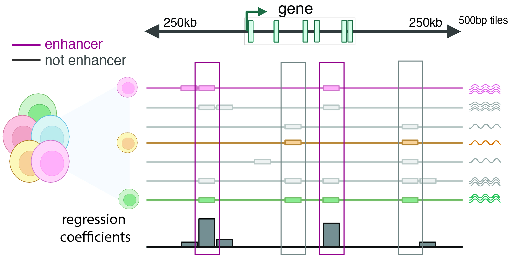

# SCARlink

Preprint available on [bioRxiv](https://www.biorxiv.org/content/10.1101/2023.06.13.544851v1).

*Documentation coming soon.*

Single-cell ATAC+RNA linking (SCARlink) uses multiomic single-cell ATAC and RNA to predict gene expression from chromatin accessibility and predict regulatory regions. It uses tile-based chromatin accessibity data from a genomic locus (+/-250kb flanking gene body) and applies regularized Poisson regression to predict gene expression. The learned regression coefficients of the tiles are informative of regulatory regions in a gene-specific manner. The regression model by itself is cell-type-agnostic. Shapley values computed by grouping cells provide insight into the regulatory regions in a cell-type specific manner. Therefore, the trained regression model can be used multiple times to identify important tiles for different groupings without retraining.


<div align="center">

</div>


## Installation 

To install SCARlink first create a conda environment:

``` python
conda create -n scarlink-env python=3.8
conda activate scarlink-env
```

Install essential R packages

```
conda install -c conda-forge r-seurat r-devtools r-biocmanager
conda install -c bioconda bioconductor-rhdf5 \
                     bioconductor-chromvar \
                     bioconductor-motifmatchr \
                     bioconductor-oncomix \
                     bioconductor-complexheatmap
```

Install ArchR in the conda environment inside R

``` r
devtools::install_github("GreenleafLab/ArchR", ref="master", repos = BiocManager::repositories())
```

Download SCARlink from GitHub and install

```
git clone https://github.com/snehamitra/SCARlink.git
pip install -e SCARlink
```

## Usage

SCARlink requires preprocessed scRNA-seq in a Seurat object and scATAC-seq in ArchR object. The cell names in both the objects need to be identical. Please refer to the [example notebook](https://github.com/snehamitra/SCARlink_private/blob/main/notebooks/preprocessing_scRNA_scATAC.ipynb) for generating Seurat and ArchR objects.

#### 1. Preprocessing
Run `scarlink_preprocessing` to generate `coasssay_matrix.h5` to use as input to SCARlink.

```
scarlink_processing --scrna scrna_seurat.rds --scatac scatac_archr -o multiome_out
```

#### 2. Running locally
For small data sets with few genes, run SCARlink sequentially on the gene set in the same output directory `multiome_out`, as before, for all the remaining steps. Note that `celltype` needs to be present in either `scrna_seurat.rds` or `scatac_archr`.

```
scarlink -o multiome_out -g hg38 -c celltype
```

#### 2a. Running locally without cell type information during training and computing cell type scores afterwards
SCARlink can also be run without providing cell type information using `-c`. In that case SCARlink only computes the gene-level regression model and does not estimate cell-type-specific Shapley values. 

```
scarlink -o multiome_out -g hg38 
```

The cell-type-specific Shapley scores can be computed later on by running `scarlink` with the `-c` parameter. In that case the previously estimated gene-regression models are used.

```
scarlink -o multiome_out -g hg38 -c celltype
```

#### 2b. Running locally with different cell type grouping
SCARlink can be run again with a different cell type annotation. For example, more granular annotations. Both `celltype` and `celltype_granular` scores would be retained.

```
scarlink -o multiome_out -g hg38 -c celltype_granular
```

#### 2c. Running on cluster by parallelizing over gene set
To speed up computation, SCARlink can be run on a cluster in parallel. By default it parallelizes over 100 cores, `-np 100` when `-np` is not provided. 
```bash
scarlink -o multiome_out -g hg38 -c celltype -p $LSB_JOBINDEX
```

#### 3. Get FDR corrected gene-linked tiles
Get table with tile-level siginificance for each gene and celltype.
```bash
scarlink_tiles -o multiome_out -c celltype 
```

#### 4. Chromatin potential
Chromatin potential analysis can be performed after running steps 1 and 2. Please refer to [example notebook](https://github.com/snehamitra/SCARlink_private/blob/main/notebooks/chromatin_potential.ipynb).

#### 5. Plot SCARlink output
SCARlink can create visualizations for the chromatin accessibility around a gene (250kb upstream and downstream of the gene body) and the gene expression for a given gene, grouped by user-provided celltype. The visualizations can help understand the connection between the accessibility at tile-level to gene expression. Note that SCARlink can generate visualizations for different cell type groupings on the fly. Example visulizations are provided in a [notebook](https://github.com/snehamitra/SCARlink_private/blob/main/notebooks/output_visualization.ipynb). The visualizations can also be generated at the command line.
```bash
scarlink_tiles -o multiome_out -c celltype --genes GENE1,GENE2
```